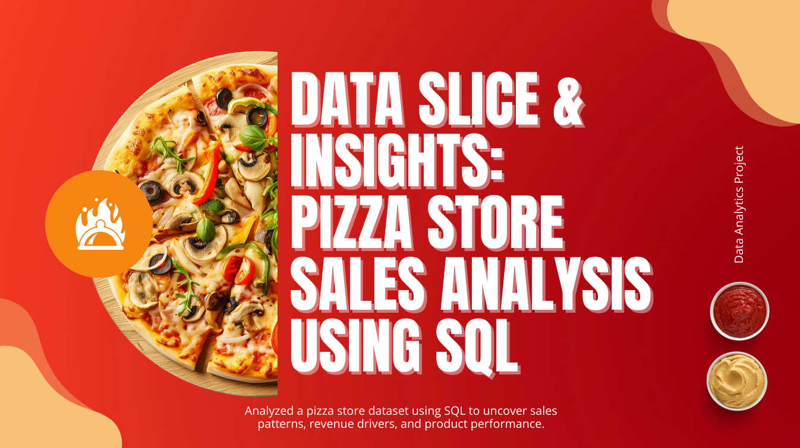

# 🍕 PIZZA STORE SALES ANALYSIS USING SQL

## 📌 Project Overview
This project focuses on analyzing pizza store sales data using **SQL** to extract meaningful business insights.  
The goal is to understand **sales performance, customer ordering behavior, revenue trends, and product popularity** by executing structured SQL queries across multiple difficulty levels.

This project demonstrates strong skills in:
- Data querying and aggregation
- Joins and subqueries
- Window functions and analytical SQL
- Business-oriented problem solving

---

## 🧩 Business Problem
The pizza business wants to understand:
- Overall sales performance and revenue
- Customer ordering patterns and peak hours
- Best-selling pizzas and categories
- Revenue contribution by pizza type
- Trends that support better inventory and marketing decisions

---

## 📊 Business Questions Addressed

### 🔹 Basic Analysis
- Retrieve the total number of orders placed  
- Calculate the total revenue generated from pizza sales  
- Identify the highest-priced pizza  
- Identify the most common pizza size ordered  
- List the top 5 most ordered pizza types along with their quantities  

### 🔹 Intermediate Analysis
- Join relevant tables to find total quantity sold for each pizza category  
- Determine the distribution of orders by hour of the day  
- Find category-wise distribution of pizzas  
- Calculate the average number of pizzas ordered per day  
- Determine the top 3 most ordered pizza types based on revenue  

### 🔹 Advanced Analysis
- Calculate the percentage contribution of each pizza type to total revenue  
- Analyze cumulative revenue generated over time  
- Determine the top 3 most ordered pizza types by revenue for each category  

---

## 🛠️ Tools & Technologies
- **SQL** (Joins, Subqueries,  CTEs (WITH), Aggregate & Window Functions)
- **Query Language**: T-SQL (Transact-SQL)
- **IDE / Tool**: SQL Server Management Studio (SSMS)
- **Database**: Microsoft SQL Server
- **GitHub** for version control and portfolio hosting

---
